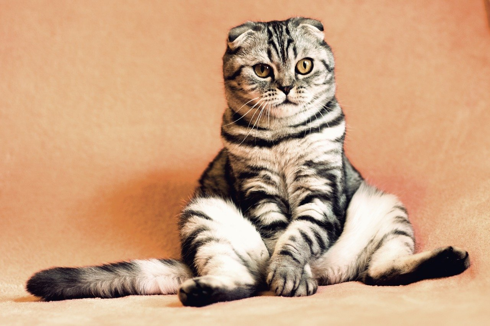
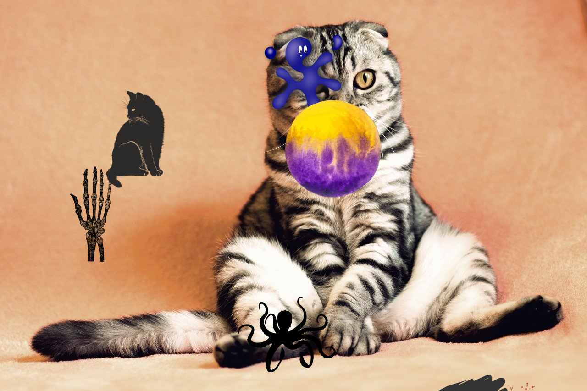
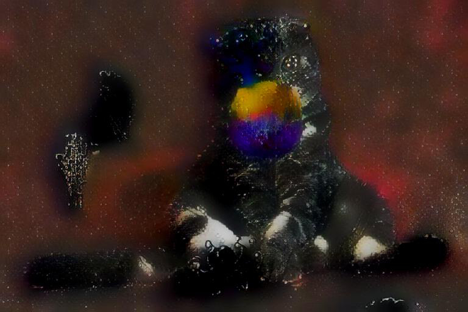

# AutoArt
Generate unique-looking art using style-transfer AIs along with random images.

## Table of contents
* [Technologies](#technologies)
* [General info](#general-info)
* [Setup](#setup)
* [Usage](#usage)

## Technologies
This project is created with:
* [opencv-contrib-python](https://pypi.org/project/opencv-contrib-python/): 4.5.1.48
* [Numpy](https://pypi.org/project/numpy/): 1.18.5
* [Pixabay](https://pixabay.com)'s API
* [Deepai's Style Transfer](https://deepai.org/machine-learning-model/fast-style-transfer) API

## General info
For whenever you need a constant stream of unique-looking images, this project has you covered. It gets a random image from a Pixabay query, overlays a number of random 'stickers' (any file in `./Overlays/`), fills transparency with an image from `./Underlays/` before completely changing the content using the [style-transfer AI](https://deepai.org/machine-learning-model/fast-style-transfer)
 
### Showcase

	
	
	
	

  
All included images are from [Pixabay](https://pixabay.com) and are licensed under [Pixabay's license](https://pixabay.com/service/terms/#license) 
	
## Setup
To run this project, simply download it and install the requirements with `pip3 install -r requirements.txt`. \
Then, specify your API key for pixabay in `./pixabay_key.txt`   
Modifying the contents of `./Overlays/`, `./Styles/`, and `./Underlays/` is recommended, but the program works out-of-the-box.

## Usage
Simply running the program with python3: `python3 generate.py` allows for the user to input a prompt. \
\
For implementation in your own projects, the `apply_style(image, style, is_url, verbose=True, retries=10, use_proxies=True, set_proxy='')` function uses [Deepai's Style Transfer API](https://deepai.org/machine-learning-model/fast-style-transfer) to apply a style to your own opencv images (or image urls).
